<div align="center">

# XENONESIS

**`Cybersecurity · Full Stack · AI/ML`**

[](https://git.io/typing-svg)

<br/>

<a href="https://github.com/Xenonesis?tab=followers"></a>&nbsp;
&nbsp;
<a href="https://github.com/Xenonesis?tab=repositories"></a>&nbsp;
<a href="https://itisportfolio-ebon.vercel.app"></a>

</div>

<br/>

---

## About

<a href="./avi-ascii.svg" title="Click to view Terminal ASCII Portrait">
  
</a>

```typescript
const XENONESIS = {
  name:      "Aditya Kumar Tiwari",
  location:  "India 🇮🇳",
  security:  ["Penetration Testing", "VAPT", "Digital Forensics", "CTF"],
  stack:     ["React", "Next.js", "Node.js", "TypeScript", "Python"],
  ai_ml:     ["TensorFlow", "PyTorch", "Computer Vision", "NLP", "LLMs"],
  directive: "break things → understand them → make them unbreakable",
  status:    "online & building 🔴",
} as const;
```

<br clear="right"/>
<details>
  <summary><b>View Terminal ASCII Portrait (<code>./portrait.sh</code>)</b></summary>
  <br/>
  <div align="center">
    
  </div>
</details>


---

## Offensive Tools

<div align="center">


</div>

---

## Tech Stack

<div align="center">

| Layer | Stack |
|:---|:---|
| **Languages** |  |
| **Frontend** |  |
| **Backend & AI** |  |
| **Data & Infra** |  |

</div>

## Featured Projects

<div align="center">

| Project | Description | Stack | Links |
| :--- | :--- | :--- | :---: |
| **Code Guardian Report** | Enterprise-grade AI-powered security analysis platform for automated vulnerability detection and code auditing. |    | [](https://github.com/Xenonesis/code-guardian-report)<br/>[Repo](https://github.com/Xenonesis/code-guardian-report) • [Demo](https://code-guardian-report.vercel.app) |
| **Juris.AI** | Next-generation legal intelligence platform delivering AI-driven document analysis and automated research workflows. |    | [](https://github.com/Xenonesis/Juris.AI)<br/>[Repo](https://github.com/Xenonesis/Juris.AI) • [Demo](https://juris-ai-roan.vercel.app) |
| **WebSage** | Intelligent browser extension featuring AI-powered fake news detection, content verification, and dark mode security tooling. |   | [](https://github.com/Xenonesis/WebSage)<br/>[Repo](https://github.com/Xenonesis/WebSage) |
| **Download-Anything** | Powerful multi-platform media extraction engine supporting batch downloads, pause/resume, and media processing. |   | [](https://github.com/Xenonesis/Download-Anything)<br/>[Repo](https://github.com/Xenonesis/Download-Anything) |

</div>

---

## Contribution Graph

<div align="center">
  
</div>

---

## Connect

<div align="center">

[](https://itisportfolio-ebon.vercel.app)
[](https://www.linkedin.com/in/itisaddy)
[](https://twitter.com/XenonesisHacks)
[](mailto:itisaddy7@gmail.com)

</div>

<br/>

---

<div align="center">

<!-- Enhanced ASCII Art with Animation -->


<br/>

<sub><code>⚡ "In a world of 1s and 0s — be the firewall that protects what matters." ⚡</code></sub>

<br/>

<!-- Interactive Visitor Counter -->


</div>
